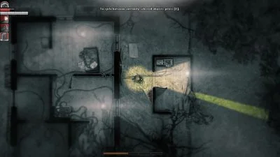

**Spielkonzept: Darkout**

## 1. **Grundidee und Ziel des Spiels**
"Darkout" ist ein PvP-Mehrspielerspiel, das in einer dunklen, labyrinthartigen Arena stattfindet. Zwei Spieler treten gegeneinander an: Einer übernimmt die Rolle des Jägers, der andere ist der Gejagte.

Das Ziel des Gejagten ist es, eine vorgegebene Anzahl an Schlüsseln zu sammeln und durch das Haupttor zu entkommen oder 5 Minuten lang zu überleben. Der Gejagte muss hingegen verhindern, dass der Jäger sein Ziel erreicht, indem er ihn verfolgt und versucht, ihn zu fangen.

## 2. **Spielmechaniken**
### Bewegung
- Beide Spieler bewegen sich frei in einer 2D-Top-Down-Ansicht.
- Der Lichtkegel (bzw. das Sichtfeld) eines Spielers hat eine feste Größe und reicht nur eine bestimmte Distanz.
- Der Gejagte kann nur fliehen und sich nicht verteidigen.
- Rückwärtslaufen ist langsamer als Vorwärtslaufen, sodass Spieler gezwungen sind, sich bewusst umzudrehen, um effizient zu fliehen.

### Interaktion
- Es gibt erstmal keine Interaktionen mit der Umgebung, außer dem Einsammeln von Schlüsseln.
- Der Jäger muss aktiv nach den Schlüsseln suchen und gleichzeitig aufpassen, nicht vom Gejagten gefasst zu werden.

### Jagdmechanik
- Der Jäger kann sich nur auf sein Sichtfeld verlassen, um den Gejagten zu finden.
- Durch ein langsamere Rückwärtslaufen entstehen strategische Möglichkeiten, um die Beute (Gejagten) einzufangen.

## 3. **Level-Design**
- Es gibt eine einzige, festgelegte Karte.
- Die Karte ist ein geschlossenes Labyrinth mit vielen Wänden und strategischen Abkürzungen.

## 4. **Licht und Sicht**
- Es gibt keine zusätzlichen Lichtquellen.
- Der Lichtkegel stellt das Sichtfeld des Spielers dar.
- Beide Spieler haben das gleiche Sichtfeld und keine weiteren Vorteile gegenüber dem anderen.

## 5. **Game Mode**
- Das Spiel ist rein PvP, es gibt keine KI.
- Eine Runde dauert maximal 5 Minuten.

## 6. **Progression und Wiederspielwert**
- Kein Punktesystem.
- Nur eine Karte.
- Fokus liegt auf wiederholtem Spielen und dem strategischen Wettkampf zwischen den Spielern.

---

**Zusammenfassung:**
"Darkout" ist ein intensives Katz-und-Maus-Spiel, bei dem sich zwei Spieler in einer dunklen Arena gegenüberstehen. Die limitierte Sicht und die asymmetrischen Ziele der Spieler sorgen für spannende Verfolgungsjagden und taktische Manöver. Ohne Punkte oder Progressionssystem liegt der Fokus auf direkter Konfrontation und strategischem Geschick.
